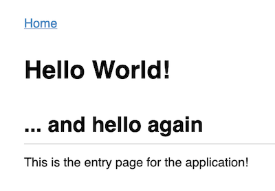

# Desenvolvimento da aplicação da 2ª parte do projeto


## Programação

A estrutura deverá ser similar à da aplicação MovieStreamApp que vimos nas aulas ([slides das aulas teóricas](https://moodle2324.up.pt/mod/resource/view.php?id=96059), [código no GitHub](https://github.com/edrdo/MovieStreamApp)):

Deve editar o código Python da aplicação em `app.py`. Cada "endpoint" da aplicação  deve efectuar uma ou mais interrogações à base de dados e utilizar os dados obtidos para gerar HTML usando templates Jinja.
Deve colocar as templates de geração de HTML (uma por "endpoint") na pasta `templates`.

### Exemplo na MovieStreamApp 

(entre vários outros) 

Informação de um filme - "endpoint" `/movies/int:id`:

- [Código no método `get_movie` em app.py](https://github.com/edrdo/MovieStreamApp/blob/master/app.py#L46)
- [Template em `templates/movie.html`](https://github.com/edrdo/MovieStreamApp/blob/master/templates/movie.html)

### Sumário das principais tags usadas no código da MovieStreamApp

#### Jinja

- `{{ x.attr }}` : expande para valor de atributo  `attr` para variável `x` -  [[ver documentação]](https://jinja.palletsprojects.com/en/3.0.x/templates/#variables) 
- ` ... `: iteração `for`sobre lista de valores `items` [[ver documentação]](https://jinja.palletsprojects.com/en/3.0.x/templates/#for)


#### HTML (com apontadores para tutorial W3 Schools)

- `<a href ...>`: [links](https://www.w3schools.com/html/html_links.asp)
- `<table> <th> <tr> <td>`: [formatação de tabelas](https://www.w3schools.com/html/html_tables.asp)
- `<ul>`, `<ol>` `<li>`: [formatação de listas](https://www.w3schools.com/html/html_lists.asp)
- `<h1>, <h2>, ...`: [cabeçalhos de nível 1, 2, ...](https://www.w3schools.com/html/html_headings.asp)
- `<p>`: [parágrafos](https://www.w3schools.com/html/html_paragraphs.asp)
- `<b>, <i>, ...`: [formatação de texto em negrito, itálico, ...](https://www.w3schools.com/html/html_formatting.asp)


## Instalação de software

Precisa de ter o Python 3 e o gestor de pacotes pip instalado.
Experimente executar `python3 --version` e `pip3 --version` para saber
se já estão instalados. Em caso negativo, pode por exemplo em Ubuntu
executar:

```
sudo apt-get install python3 python3-pip
```

Tendo Python 3 e pip instalados, deve instalar a biblioteca `Flask` executando o comando:

```
pip3 install --user Flask
``` 

## Configuração de acesso à BD

Edite o ficheiro `db.py` no que se refere à configuração da sua BD, modificando os parâmetros `DB_FILE` que indique o ficheiro da base de dados. O ficheiro SQLite para a BD deve residir na mesma pasta que o ficheiro `app.py`.

Configurados o parâmetro `DB_FILE`,  teste o acesso executando:

```
python3 test_db_connection.py NOME_DE_UMA_TABELA
```

Se a configuração do acesso à BD estiver correcto, deverá ser listado o conteúdo da tabela `NOME_DE_UMA_TABELA`, por ex. se a BD configurada fosse a dos recintos culturais e quisermos listar a tabela `atividades` obteríamos:

```
$ python3 test_db_connection.py atividades
6 results ...
[('ref', 1), ('atividade', 'cinema')]
[('ref', 2), ('atividade', 'circo')]
[('ref', 3), ('atividade', 'dança')]
[('ref', 4), ('atividade', 'música')]
[('ref', 5), ('atividade', 'tauromaquia')]
[('ref', 6), ('atividade', 'teatro')]
```

## Execução do servidor da aplicação

Depois de configurar a BD como descrito acima, pode agora iniciar o servidor da aplicação executando `python3 server.py`, ex.:

```
$ python3 server.py
2021-05-18 21:40:46 - INFO - Connected to database guest
 * Serving Flask app "app" (lazy loading)
 * Environment: production
   WARNING: This is a development server.  Do not use it in a production deployment.
   Use a production WSGI server instead.
 * Debug mode: off
2021-12-08 21:40:46 - INFO -  * Running on http://0.0.0.0:9000/ (Press CTRL+C to quit) 
...
```

De seguida abra no seu browser __http://127.0.0.1:9000__ ou __http://localhost:9000__. Deverá ver uma página com uma mensagem __Hello World!__ da forma ilustrada na imagem a seguir.



## Mais referências

- [Aplicações BD com SQL embebido](https://moodle2324.up.pt/mod/resource/view.php?id=96059) (slides das aulas teóricas)
- [MovieStream - aplicação exemplo](https://moodle.up.pt/mod/resource/view.php?id=77946)
- HTML: 
   - [W3 schools tutorial simples](https://www.w3schools.com/html/default.asp)
   - [referência Mozilla](https://developer.mozilla.org/en-US/docs/Web/HTML) 
- Bibliotecas:
  - [sqlite3](https://docs.python.org/3/library/sqlite3.html)
  - [Flask](https://flask.palletsprojects.com/en/1.1.x/)
  - [Jinja templates](https://jinja.palletsprojects.com/en/2.10.x/templates/)

